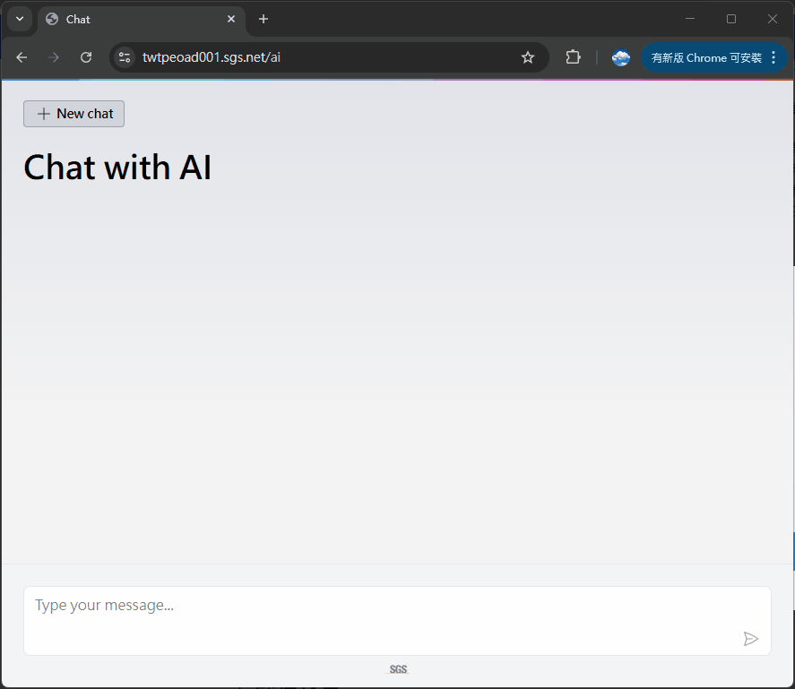
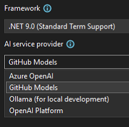
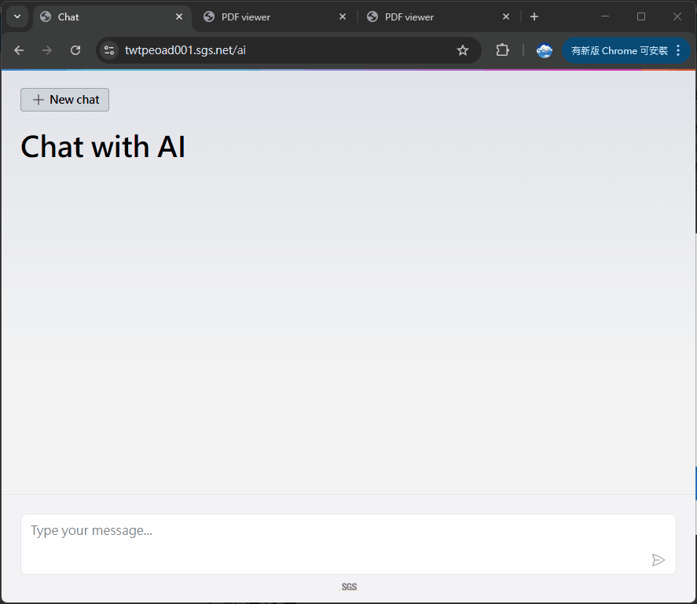

# 🦜demoAiChat

- 實作微軟發布新 [.NET AI Template](https://devblogs.microsoft.com/dotnet/announcing-dotnet-ai-template-preview1/)
- 測試 `OpenAI`, `Ollama` 與 `GitHub` provider
- 執行了一個簡單的 Use Case

# 📱效果展示



- 查詢知識庫內資料，並提供資料來源作為附件
- 自動生成關聯建議問題
- 可檢視資料來源，如有對應區塊會標註

>最後還有其他展示，關於詢問其資料內容與其他專業知識等

# 🎉.NET AI Template

- 以 Blazor 為基礎開發，便於快速建立 AI 聊天應用
- 支援 RAG，可自行整合自訂資料來源
- 支援本地端向量資料庫或 Azure AI Search

# 🤖AI Service Provider



- 目前提供四種 provider，每種都會生成 `README.md` 說明文件
- 如果有 GitHub 帳號，選擇 `GitHub Models` 最簡單，申請 API Key 即可
- 建議使用 GitHub 或 OpenAI

>[!NOTE]
> - 如果有安裝 `Ollama` 可使用本地模型，注意預設有固定的組合
> - 效能會依照選用模型參數與硬體設備等級而不同

# 🔒User Secrets

- 如需進行任何 API Key 設定，建議使用 `User Secrets` 管理
- `User Secrets` 可將敏感資訊儲存於本地 `secret.json` 檔案之中，不進版控
- `Visual Studio 2022` > `專案按右鍵` > `Manage User Secrets`

>[!CAUTION]
>切記 API Key 務必妥善管理，避免洩漏，不可納入版控

# 🚀Deployment

- 基本上與一般 `ASP.NET Core` 網路應用無異
- 確認 `App.razor` 之基底路徑是否需修改
  
  ```html
  <base href="/" />
  ```
- 確認 `appsettings.Production.json` 設定是否正確

>[!IMPORTANT]
>系統支援 `Web Socket`，可檢查 IIS 是否安裝，以獲取更好的使用體驗

# 👤Use Case

- 聯繫 BU 同仁取得少量實際資料測試
- 來源以文字資料為主，截圖透過 OCR 轉為文字
- 原始文字內容透過簡單整理與分類，建立數個 `Markdown` 檔案
- 將所有 `Markdown` 轉為 `pdf`
- 依照標準程序將檔案導入專案並建置向量資料庫
- 進行測試與部署

>[!TIP]
> - 資料的清理與整理非常重要
> - 預設僅支援 `pdf`，猜測也必須是文字類型
> - 檔案如果超過 Token 上限，可能須替換模型或作法

# 📱其他展示


- 詢問其資料，僅會顯示其知識庫內容



- 詢問臭度範例