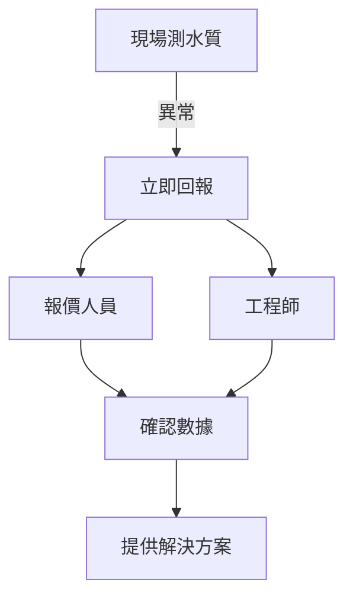

# 現場測水質若有異常

- 再次向大家宣導，現場測水質若有異常請立即向報價人員回報
- 一般pH6~8.5，餘氯2以下，導電度依照水質(飲用水1000以下)
- 如果記不起來可以都回報給工程師或報價人員，他們會確認

# AI 延伸補充資料
- 異常水質需立即記錄並標記，避免誤用
- 定期校準測量儀器，確保數據準確
- 現場人員需熟悉水質標準範圍，及時發現異常
- 報價人員需快速反應，提供解決方案

# 示意圖
