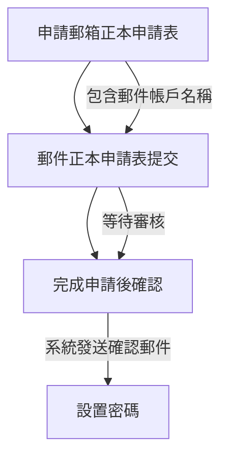

根據你提供的圖片，這是一封電子郵件，內容主要是關於 IEQ-S 高雄辦公室申請郵箱帳號的流程說明。我會幫你辨識並整理其中的資料：

### 基本資訊
- **主旨 (Subject)**: IEQ-S高雄辦公室申請郵箱帳號教學流程
- **發送者**:
  - 姓名: Lai, Shin (賴欣)
  - 職位: Kaohsiung Envi Admin 1 (高雄環境管理員 1)
  - 公司: TW Envi IEQ (台灣環境 IEQ)
  - 電子郵件: Lai.Shin@KaohsiungCity (賴欣@高雄市)
  - 共同發送者: Chen, Linda (陳琳達) (Kaohsiung市)
- **收件人**: Dear All (親愛的大家)
- **日期**: 圖片中未明確顯示具體日期，但根據上下文可能與當前日期 (2025 年 3 月 13 日) 相關，或為歷史郵件。

### 內容摘要
郵件內容提供了申請公司郵箱帳號的步驟，具體如下：

1. **申請郵箱正本申請表**:
   - 請將正本申請表 (mail 給我和和會要記得提供郵件帳戶名稱) 傳給發送者 (Lai, Shin) 和另一位聯繫人。
   - 申請表需包含以下資訊：
     - 郵件帳戶名稱
     - 其他相關資料 (未具體說明)

2. **郵件正本申請表提交**:
   - 請將申請表提交至公司內部郵件系統 (mail 相關部門)，並標記為“郵件帳戶申請”。
   - 提交後，等待審核。

3. **完成申請後**:
   - 申請通過後，系統會自動發送確認郵件至申請人。
   - 申請人需檢查郵件並根據指示設置密碼。

### 其他資訊
- **語言**: 主要為中文，部分術語使用英文 (如 "mail" 和 "account")。
- **格式**: 郵件採用列表形式，清晰列出三個步驟。
- **附件**: 圖片中未顯示附件，但可能附有申請表範本 (根據內容推測)。

### 數據提取與整理
| 欄位            | 資料內容                     |
|-----------------|------------------------------|
| 主旨            | IEQ-S高雄辦公室申請郵箱帳號教學流程 |
| 發送者姓名      | Lai, Shin (賴欣)             |
| 共同發送者姓名  | Chen, Linda (陳琳達)         |
| 發送者職位      | Kaohsiung Envi Admin 1       |
| 公司            | TW Envi IEQ                  |
| 發送者郵件      | Lai.Shin@KaohsiungCity       |
| 收件人          | Dear All                     |
| 步驟 1          | 申請郵箱正本申請表           |
| 步驟 2          | 提交郵件正本申請表           |
| 步驟 3          | 完成申請後確認               |

### 注意事項
- 郵件中提到“mail 給我和和會要記得提供郵件帳戶名稱”，可能有語法錯誤或輸入錯誤，應為“mail 給我和 Linda，要記得提供郵件帳戶名稱”。
- 如果需要進一步分析附件或具體申請表格式，請上傳相關文件，我可以幫你處理。

### 示意圖

如果你有其他問題或需要更詳細的分析（例如翻譯成其他語言或提取特定資訊），請告訴我！