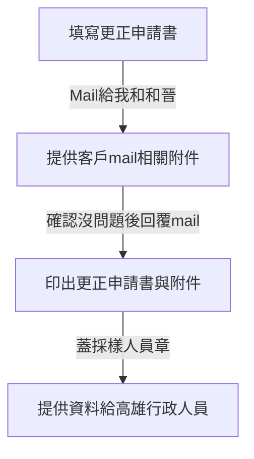

# 高雄更正申請書簽核與審核流程

即日起高雄更正申請書簽核與審核流程如下，請相關人員注意

- 請將更正申請書填好後mail給我和和晉
- 記得提供客戶mail相關附件(請給PDF檔)
- 確認沒問題後會回覆mil
- 將更正申請書與附件印出後，可以蓋採樣人員章(小歐或明憲並壓上日期，可以是mail回覆日期)
- 再把這些資料提供給高雄行政人員後續作業。

# AI 延伸補充資料
- 更正申請書需詳細描述更正原因及內容
- 客戶附件需包含所有相關資料，確保審核順利
- 簽核過程中需保持溝通，及時解決問題
- 行政人員需妥善保存所有文件，便於查閱

# 示意圖
