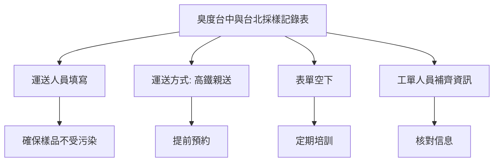

# 臭度台中與台北採樣記錄表

- 臭度台中與台北採樣記錄表要求填寫「運送人員」
- 運送方式增加「高鐵親送」
- 請採樣人員注意表單需要空下
- 負責提供工單人員請將相關資訊補齊後交單

# AI 延伸補充資料
- 運送人員需確保樣品在運送過程中不受污染
- 高鐵親送需提前預約並確認運送時間
- 採樣人員需定期接受培訓，確保表單填寫正確
- 工單人員需核對所有信息，確保無誤後再交單

# 示意圖
